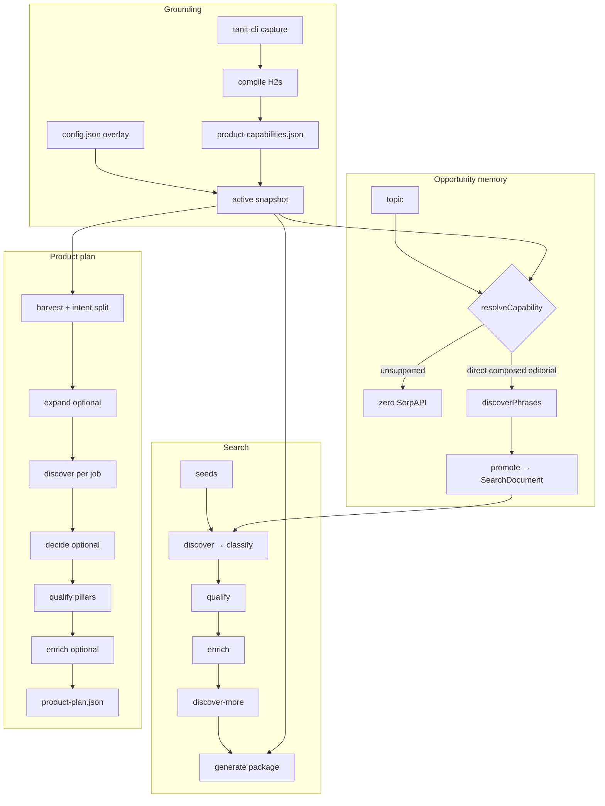
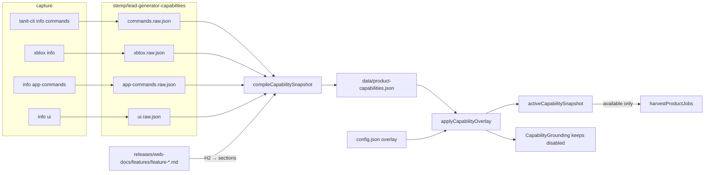
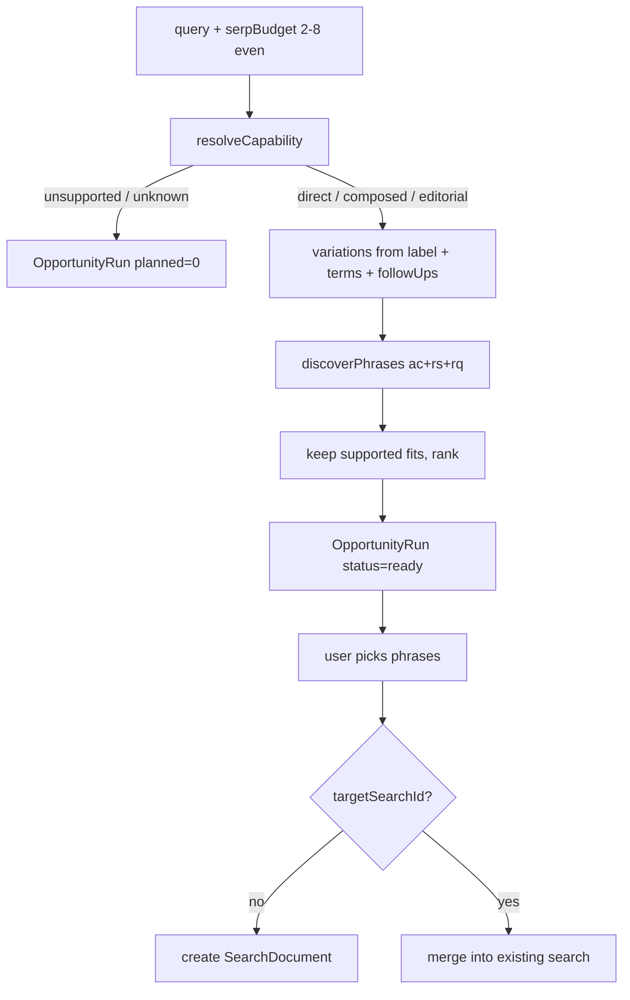
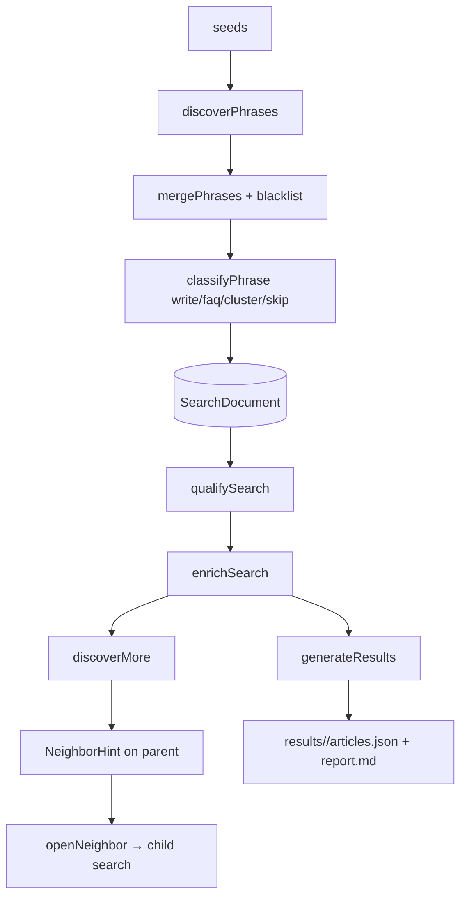
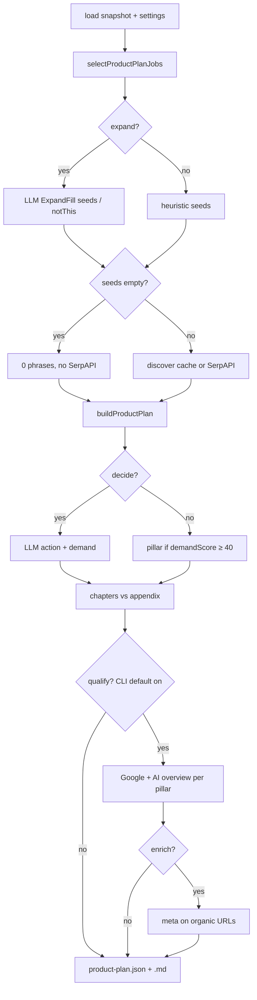
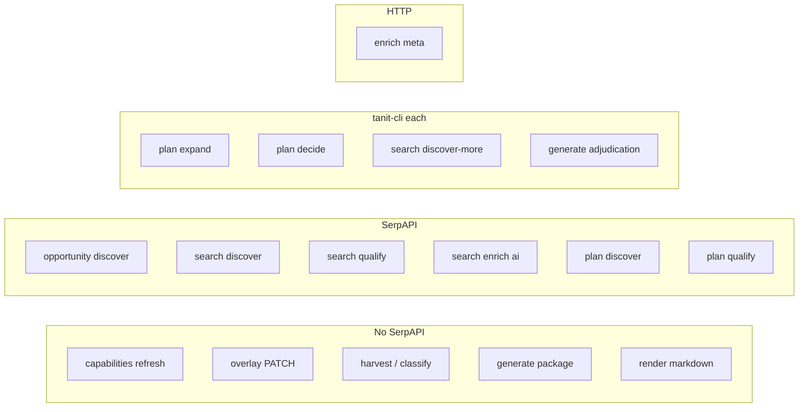
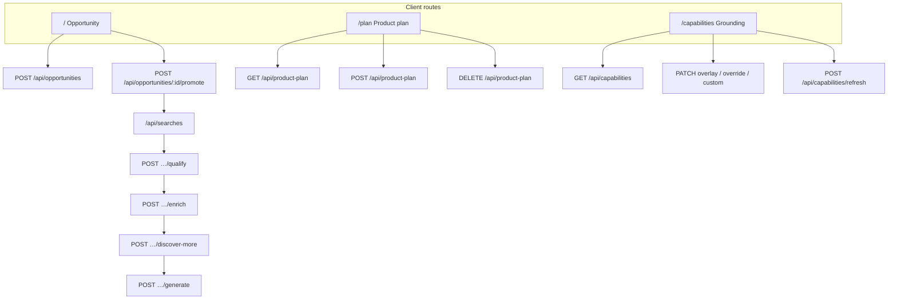

# Data flow

How records move. Types and files: [data-model.md](./data-model.md). GUI and CLI call the same `src/lib` functions.

Three pipelines share one grounding snapshot. They do **not** share a search document unless you promote an opportunity or open a neighbor.

## Surfaces

| Surface | Entry | Same code |
| --- | --- | --- |
| GUI `/` | `POST /api/opportunities` | `discoverOpportunity` |
| GUI searches | `/api/searches/*` | `createSearch` / `qualifySearch` / `enrichSearch` / `discoverMore` / `generateResults` |
| GUI `/plan` | `POST /api/product-plan` | `runProductPlan` (exclusive lock) |
| GUI `/capabilities` | `/api/capabilities*` | overlay + `refreshCapabilities` |
| CLI `phrases run` | `runPipeline` | search stages in order |
| CLI `phrases product-plan` | `runProductPlan` | plan stages |
| CLI `phrases serve` | Express `3780` | all of the above |

Paid sides:

- **SerpAPI** — autocomplete, related searches, People Also Ask, Google organics, AI overview page tokens. Needs `SERPAPI_KEY`.
- **Page fetch** — `meta` enricher (title / description / OG / headings). Not SerpAPI.
- **LLM** — `tanit-cli llm agent each` (`PHRASES_LLM_BIN`). Expand, decide, discover-more, generate adjudication.

---

## Grounding

Refresh is **offline** (no SerpAPI). Overlay is **not** rewritten.

`npm run capabilities:refresh` = capture then compile. `capture` writes raw JSON only. `compile` folds feature markdown (skips App/CLI/XBlox boilerplate H2s) and writes the snapshot.

`loadCapabilitySnapshot` always applies the overlay then **drops** `available: false` nodes and `disabledWorkflows`. The GUI grounding endpoint applies the overlay but **keeps** disabled rows so the tree can toggle them.

| Overlay write | Route / CLI | Effect on later runs |
| --- | --- | --- |
| disable capability | `PATCH /api/capabilities/:id` | harvest + match skip it |
| disable workflow | `PATCH /api/capabilities/workflows/:id` | harvest skips that family |
| description / terms | `PATCH /api/capabilities/:id/override` | compiled copy; intents inherit terms |
| custom cap | `POST /api/capabilities/custom` | harvested as `custom:*` |
| recapture | `POST /api/capabilities/refresh` | snapshot only; overlay stays |

Harvest grouping (pure, in memory until a plan run):

1. Workflow families (`job:workflow:<family>`) from XBlox node clusters.
2. Remaining commands / blocks / surfaces / documentation / overlay custom → `job:<capability-id>`.
3. Documentation with **≥2** `sections` also yields `job:intent:<feature>:<section>`. Parent documentation jobs stay in the GUI catalog; `expandProductPlanJobs` **replaces** them with intents before SERP.

Intent `terms` copy the parent job (overlay terms included). Seeds stay heading heuristics unless Expand fills them.

---

## Opportunity

Disposable. Not on disk. TTL 1 hour. Gone on process restart.

Unsupported topics return the `ProductMatch` and **do not** call SerpAPI (`budget.planned = 0`). Promote copies selected `PhraseRecord`s, landscape, and per-phrase matches onto a search, then the search pipeline continues (qualify / enrich / generate).

---

## Search pipeline

Durable store: `<data>/searches/<id>.json`. One-shot CLI: `phrases run <seeds>`.

### Discover

`discoverPhrases(seeds, locale, options)`:

| Engine | Flag / option | SerpAPI |
| --- | --- | --- |
| autocomplete | `ac` | per seed; `alphabet` adds 26 suffixes; `questionPrefixes` adds how/what/why |
| related_searches | `rs` | Google related |
| people_also_ask | `rq` | PAA; `paaDepth` extra hops 0–4 |

Each seed is also inserted as `source: seed`. Junk URLs dropped. Scores: niche 0–100 from length + question + source overlap. Blacklist (settings) applied when merging into the document.

`phrases search` / `POST /api/searches` stop here. `phrases expand` / `POST …/expand` runs discover again and merges.

### Qualify

Picks up to `--limit` (default 6) write/faq phrases. One Google SERP per target (pool 2). If the document has no landscape yet, also fetches the first seed. Writes `PhraseSerpRef.organics` + extra PAA questions into `phrases`, and `landscape[]`.

### Enrich

Does **not** invent URLs. Collects ranking links already on the document.

| Enricher | What | Cost |
| --- | --- | --- |
| `meta` | page head + bounded headings/excerpt | HTTP fetch |
| `ai` | Google AI overview via SerpAPI page token | SerpAPI |

Default `phrases run`: `meta,ai`, limit 20 unique URLs. Existing `sites[url]` reused unless `--force`.

### Discover-more

Builds hubs from the search, shells `tanit-cli llm agent each`, writes `neighbors[]` + `discoverMore` meta. `--dry-run` uses json-stub. Opening a neighbor creates (or jumps to) a child `SearchDocument` with `parentId`. Pipeline treats LLM failure as a warning and continues to generate.

### Generate

No SerpAPI. Reads the search + active snapshot + settings.

1. `buildArticlePackage` (deterministic, `llmGrounding: false`).
2. Optional `adjudicateCapabilities` for hubs with fit `editorial` or `composed` (one cached LLM each). `--no-llm` skips.
3. Rebuild package with adjudications.
4. Write `articles.json` + `report.md`.

Filters (`minNiche`, `minWords`, `roles`, `qualifiedOnly`) drop rows into `skip[]`. Overlapping titles collapse into `ArticleHub`s.

---

## Product plan

Inverts the search: jobs first, then a **bounded** SERP per job. Output: `<data>/results/product-plan/`.

### Job selection

1. `harvestProductJobs(active snapshot)`.
2. If `--jobs` / `jobIds` set, keep those ids from harvest **plus** intent extras (so an expanded feature can be addressed by parent or intent id).
3. Else keep harvested jobs (parents, not every intent).
4. `expandProductPlanJobs` swaps documentation-with-sections for intent jobs.
5. `maxJobs` slices the list.

GUI checks jobs then **Run**. Stages Expand / Decide / Qualify / Enrich are **opt-in toggles** on the GUI (`Boolean(body.*)`). CLI: Expand/Decide/Enrich off, **Qualify on** (`--no-qualify` to skip).

### Expand

Only `proofKind: "intent"`. Writes `product-plan.expand.in.json` / `.out.json`. Fills `job.seeds` and `job.notThis`. Blank `[]` is kept (skips discover). Cache: `.cache/expand.json` keyed by intent digest. `--force-expand` ignores it. LLM failure is a warning; heuristic seeds remain.

### Discover

Per job, up to 4 seeds. Budget `--serp-budget`:

- `2` — autocomplete only.
- `4` — autocomplete + related + PAA.

Cache: `.cache/discover/<jobId>.json` keyed by jobId + budget + locale + seeds. Failures yield empty phrases (plan still builds).

Global phrase ownership: `buildProductPlan` assigns each normalized phrase to one job (first claim). Unclaimed phrases become `productHoles`.

### Decide

Optional. LLM fills `action` (`pillar` | `section` | `skip`) and `demand`. Without it, heuristic: discovered + `demandScore ≥ 40` → pillar. Sidecars: `product-plan.decide.in.json` / `.out.json` / `product-plan.questions.json`. Cache: `.cache/decide.json` keyed by discovery digest.

Pillars stay in `chapters`. Skip (and weak section) land in `appendix`.

### Qualify

Default on in CLI. **Pillars only.** Up to 4 Google queries: canonical + extra question phrases. Merges organics + PAA answer links; first AI overview snippet. Cache version **2**: `.cache/qualify/<jobId>.json`. `applyEvidence` attaches `evidence`, ranking leaves (`social` / `apps`), and a gap sentence.

### Enrich

Opt-in. Needs qualify evidence (or its cache). Fetches `meta` for organic URLs (plan default enricher is `meta`; AI overview already ran in qualify). Cache: `.cache/enrich/<jobId>.json`.

### Write / cache control

`writeProductPlan` → `product-plan.json` + `product-plan.md`. `--render-only` rebuilds markdown. `--clear` deletes artifacts + `.cache`. `--remove-jobs` drops chapters. `--no-cache` skips reads/writes. `--force` = all `--force-*`.

The GUI holds an exclusive lock: one plan run at a time. `ProductPlanRunState` is process memory (log strip), not a file.

---

## Paid calls

| Step | Typical bound |
| --- | --- |
| Opportunity | even budget 2–8 (max 12); 0 if unsupported |
| Search discover | 1 call per engine × seed (+ alphabet / prefixes / PAA depth) |
| Search qualify | `limit` Google calls (default 6) + optional seed landscape |
| Search enrich | up to `limit` page fetches + AI tokens |
| Plan discover | 2 or 4 calls **per job** |
| Plan qualify | ≤4 Google calls **per pillar** |
| Plan expand / decide | one LLM each over the batch |
| Generate | 0 SerpAPI; 0–1 LLM each for editorial/composed hubs |

Stage caches mean reruns of the same keys cost zero.

---

## GUI map

Settings (`blacklist`, `product`) sit on `/api/settings` and feed classify, match, harvest, and generate. User-config / sessions / scripts are installer helpers, not the niche pipelines.

---

## Cross-cutting

**Blacklist.** Whole-word (or phrase) filter in `config.json`. Applied when merging phrases and when classifying. Does not delete historical rows already stored.

**Product profile.** `doesNot` / `notPlatforms` constrain `ProductMatch` and generate claims.

**Idempotent writes.** Search store and plan writers use pretty JSON + trailing newline. Plan cache keys include locale and seeds so a seed-fill change misses the old discover file.

**Classify vs match.** `PhraseClass.role` (write/faq/cluster/skip) is editorial. `ProductMatch.fit` (direct/composed/editorial/unsupported) is capability grounding. Opportunity ranking uses fit; generate hubs use both.

**Two Expand words.** Search `expand` = more SERP discovery into an existing document. Plan `expand` = LLM fill of intent seeds before SERP. Different functions.
