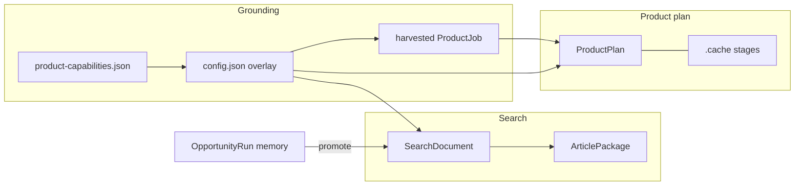
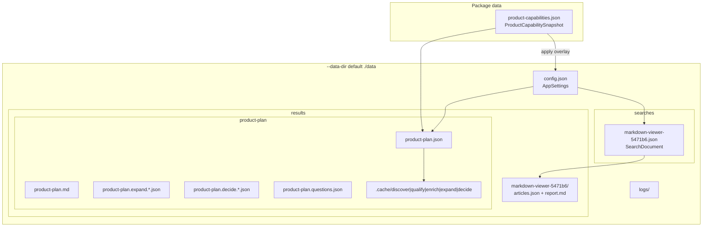
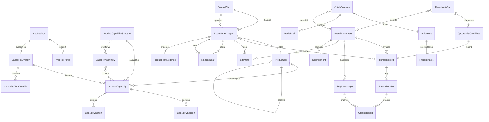
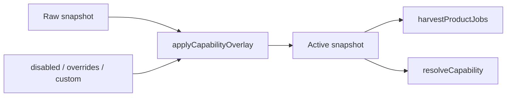
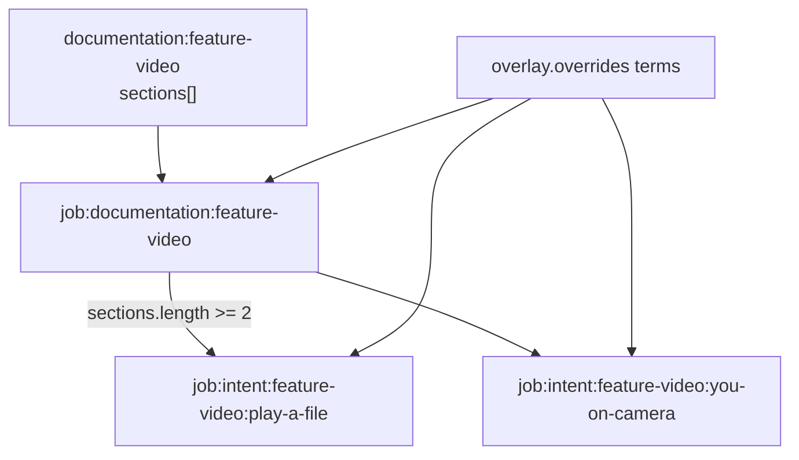
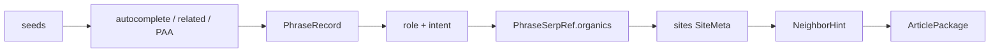
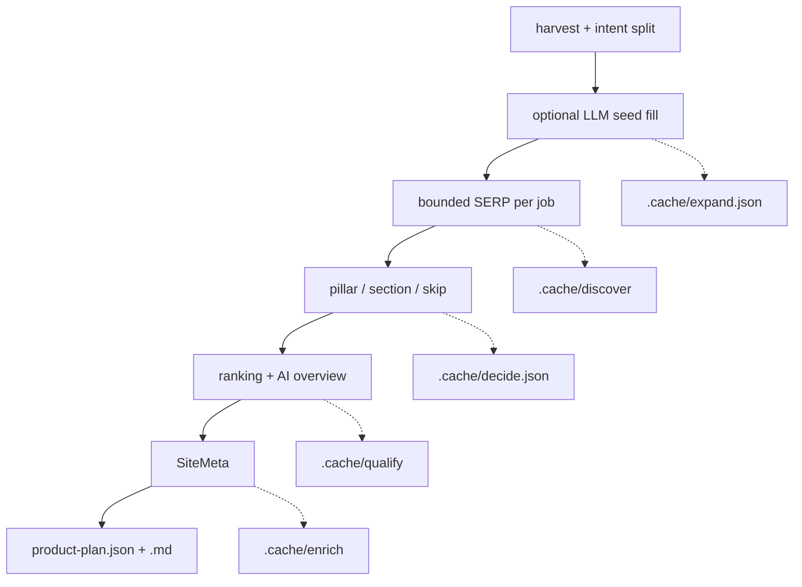

# Data model

Canonical types live in `src/shared/`. This document is the map of what is stored, how records relate, and which files each aggregate occupies. GUI and CLI share the same JSON.

Three durable aggregates:

1. **Grounding** — compiled Tanit capabilities plus a durable overlay.
2. **Search** — one seed-driven SERP workspace (`data/searches/<id>.json`).
3. **Product plan** — job-first invert of the same snapshot (`data/results/product-plan/`).

Ephemeral: **opportunity runs** (in-memory, 1 hour). Derived: **article packages** under `data/results/<search-id>/`.



## On disk

`--data-dir` / `PHRASES_DATA` / `PHRASES_DATA_ROOT` scopes searches, results, logs, and `config.json` (`PHRASES_CONFIG`). The compiled snapshot defaults to `data/product-capabilities.json` (package data, not the `--data-dir` root).

| Path | Aggregate | Source of truth |
| --- | --- | --- |
| `data/product-capabilities.json` | Grounding snapshot | Capture + compile |
| `<data>/config.json` | Settings + overlay | GUI / API / CLI |
| `<data>/searches/<id>.json` | `SearchDocument` | Search pipeline |
| `<data>/results/<id>/articles.json` | `ArticlePackage` | Generate |
| `<data>/results/<id>/report.md` | Rendered package | Generate |
| `<data>/results/product-plan/product-plan.json` | `ProductPlan` | `runProductPlan` |
| `<data>/results/product-plan/product-plan.md` | Rendered plan | Same |
| `<data>/results/product-plan/.cache/` | Stage caches | Discover / expand / decide / qualify / enrich |
| `<data>/logs/` | Runtime | Server + shell |



## Identity

IDs are stable strings. Prefixes are part of the id.

| Kind | Pattern | Example |
| --- | --- | --- |
| Command | `command:<name>` | `command:video` |
| Ribbon custom command | `command:custom.<id>` | `command:custom.product-photo` |
| Overlay custom cap | `custom:<slug>` | `custom:video-player` |
| XBlox block | `block:<id>` | `block:videoCapture` |
| UI surface | `surface:<id>` | — |
| Feature page | `documentation:<slug>` | `documentation:feature-video` |
| Feature H2 | `documentation:<slug>#<section>` | `documentation:feature-video#play-a-file` |
| Workflow | `workflow:<id>` | `workflow:video-recorder` |
| Harvested job | `job:<capability-id>` | `job:documentation:feature-markdown` |
| Workflow family job | `job:workflow:<family>` | `job:workflow:video-recorder` |
| Intent job | `job:intent:<feature>:<section>` | `job:intent:feature-video:you-on-camera` |
| Search | slug + short hash | `markdown-viewer-5471b6` |
| Catalog row (GUI) | `cap:<id>` / `wf:<id>` / `g:<kind>` | `cap:documentation:feature-video` |

Harvested jobs keep `capabilityIds` and `proofIds` pointing back at snapshot nodes / workflows / section fragments.

## Entity map



---

## Partial: settings

File: `<data>/config.json`. Type: `AppSettings`.

Survives snapshot recapture. Overlay is the only place compiled feature copy can be pinned.

```ts
AppSettings {
  blacklist: string[]          // whole-word phrase filter
  product: ProductProfile | null
  capabilities?: CapabilityOverlay
}

ProductProfile {
  name, url?, summary?
  platforms: string[]
  notPlatforms: string[]
  doesNot: string[]            // claims that must never be made
}

CapabilityOverlay {
  disabled: string[]           // capability ids
  disabledWorkflows: string[]  // workflow ids
  custom: ProductCapability[]  // ids custom:*
  overrides?: {
    [capabilityId]: { description?: string, terms?: string[] }
  }
}
```

`overrides` apply only to compiled ids (not `custom:*`). Custom overlay rows are edited as full `ProductCapability` records.



## Partial: capability snapshot

File: `data/product-capabilities.json`. Type: `ProductCapabilitySnapshot`. `schemaVersion: 1`.

Built by capture (`tanit-cli` commands, custom ribbon, XBlox, UI surfaces) then compile (feature markdown H2s → `sections`).

```ts
ProductCapabilitySnapshot {
  schemaVersion: 1
  generatedAt: string
  product: string
  sources: { commands, xblox, examples[], documentation[] }
  capabilities: ProductCapability[]
  workflows: CapabilityWorkflow[]
}

ProductCapability {
  id, kind: command|block|surface|documentation
  label, description
  available: boolean
  terms, inputs, outputs: string[]
  options: CapabilityOption[]
  source: string
  sections?: CapabilitySection[]   // compiled H2s on documentation
}

CapabilitySection { id, label, summary, command? }
CapabilityWorkflow { id, label, nodeIds[], source }
```

GUI grounding (`CapabilityGrounding`, API `/api/capabilities`) is the overlay applied onto this snapshot, plus harvested `jobs` and counts. Disabled nodes stay in `capabilities` with `available: false`; harvest and search matching drop them.

```ts
CapabilityGrounding {
  path, generatedAt, product
  overlay: CapabilityOverlay
  counts: { capabilities, workflows, commands, blocks, surfaces,
            documentation, jobs, enabled, disabled, custom, customCommands }
  capabilities, workflows, jobs
}
```

### Harvested jobs

Pure function `harvestProductJobs(snapshot)` → `ProductJob[]`. Not stored until a plan run writes chapters.

```ts
ProductJob {
  id, label
  proofKind: workflow | command | documentation | intent
  proofIds, capabilityIds, sources, terms: string[]
  parentId?          // intent → job:documentation:…
  summary?, command? // from CapabilitySection
  seeds?, notThis?   // Expand fill; empty seeds skip SERP
}
```

Documented pages with **two or more** `sections` expand to intent jobs (`job:intent:<feature>:<section>`). Parent documentation jobs stay in the harvested list for the GUI tree but `expandProductPlanJobs` replaces them with intents before SERP. Intent `terms` include the parent (so overlay terms show on expanded features).



Fit labels used on matches and plan chapters:

`direct | composed | editorial | unsupported | unknown`

`ProductMatch` is the grounding decision for a phrase or hub: fit, confidence, outcome, nodeIds, optional workflowId, evidence, constraints, follow-ups, rationale.

## Partial: search document

File: `<data>/searches/<id>.json`. Type: `SearchDocument`.

One saved workspace. Opportunity runs copy into this on promote.

```ts
SearchDocument {
  id, name, createdAt, updatedAt
  locale: { gl, hl, googleDomain }
  seeds: string[]
  options: DiscoverOptions     // engines, paaDepth, alphabet, questionPrefixes
  phrases: PhraseRecord[]
  landscape?: SerpLandscape[]  // seed SERP slices
  sites?: { [normalizedUrl]: SiteMeta }
  parentId?, neighbors?: NeighborHint[]
  discoverMore?: DiscoverMoreMeta
  opportunity?: { runId, query, promotedAt, matches }
  meta: { calls: SerpCallMeta[], errors: SearchError[] }
}

PhraseRecord {
  phrase
  sources: autocomplete | related_searches | people_also_ask | manual | seed
  seeds, scores: PhraseScores, class?: PhraseClass
  addedAt
  serp: PhraseSerpRef | null   // filled by qualify
}

PhraseScores { niche 0-100, wordCount, isQuestion, relevance, sourceCount }
PhraseClass { intent, role: write|faq|cluster|skip, reason }
```



`SearchSummary` is the list projection: id, name, dates, seeds, phraseCount, locale, parentId, neighborCount.

`SearchSnapshot` is a derived headline for reports (role counts, questions, avg niche, top hosts, productShare). Not stored separately.

## Partial: SERP, pages, ranking

Shared across searches and the product plan.

```ts
OrganicResult { position, title, link, snippet?, source?, date? }

SerpLandscape { query, searchId: string | null, features[], organics[] }

SiteMeta {
  url, finalUrl?, title?, description?, image?, canonical?, siteName?
  keywords[], headings[], excerpt?
  og?: SiteOg
  httpStatus?, error?, fromCache?
  enricher, fetchedAt, ms
}

RankingLeaf {
  kind: social | apps
  network, host, title, link
  snippet?, source?, position: number | null, date?
  phrases[]                 // which queries found this URL
}
```

`collectRankingLeaves` buckets organics (plus site titles) into social networks vs app stores. Used by search generate and by plan chapters.

### Neighbors

Discover-more writes hints onto the parent search; promoting a hint creates a child `SearchDocument` with `parentId`.

```ts
NeighborHint { seed, why, via, kind: seed|survivor|related, searchId? }
DiscoverMoreMeta { ranAt, hubs, cacheHits, transformed, source, dest }
```

## Partial: opportunity

Not on disk. `OpportunityStore` holds runs until `expiresAt` (one hour) or process restart.

```ts
OpportunityRun {
  id, status: ready | promoted
  query, createdAt, expiresAt
  locale
  productMatch: ProductMatch    // topic vs snapshot, before paid calls
  variations: string[]
  candidates: { phrase, record, productMatch, rank }[]
  landscape, calls, errors
  budget: { requested, planned, attempted }
}
```

Unsupported topics return the `ProductMatch` with **zero** SerpAPI calls. Promote writes selected phrases into a `SearchDocument`.

## Partial: product plan

Directory: `<data>/results/product-plan/` (override with `--out`). Type: `ProductPlan`. `schemaVersion: 1`.

```ts
ProductPlan {
  schemaVersion: 1
  product, generatedAt
  chapters: ProductPlanChapter[]   // pillar + section
  appendix: ProductPlanChapter[]   // skip
  productHoles: string[]
  metrics: { jobs, phrases, pillars, sections, skipped, holes }
}

ProductPlanChapter {
  jobId, label, canonicalQuery, absorbedQueries[]
  proofKind, proof[], parentId?, summary?, command?, seeds?
  fit, demandScore, priority
  action: pillar | section | skip
  demand, gap
  qualified: boolean
  phrases[], sites[], social[], apps[]
  evidence?: ProductPlanEvidence   // qualify payload
}

ProductPlanEvidence {
  query, organics[], aiOverview?, sites?, error?
}
```

Sidecar LLM payloads (same directory, not the plan schema):

| File | Role |
| --- | --- |
| `product-plan.expand.in.json` / `.out.json` | Intent seed fill (`ExpandFill`) |
| `product-plan.decide.in.json` / `.out.json` | Chapter action fill |
| `product-plan.questions.json` | Question dump |

### Stage cache

Directory: `product-plan/.cache/`. Invalidate with `--force*` / `--no-cache` / `--clear`.

| File | Type | Key |
| --- | --- | --- |
| `discover/<jobId>.json` | `DiscoveryCacheEntry` | jobId + serpCallsPerJob + locale + seeds |
| `expand.json` | `ExpandCacheEntry` | digest → `{ [jobId]: ExpandFill }` |
| `decide.json` | `DecideCacheEntry` | digest → `{ [jobId]: { action, demand } }` |
| `qualify/<jobId>.json` | `QualifyCacheEntry` | version 2 + jobId + canonicalQuery + locale |
| `enrich/<jobId>.json` | `EnrichCacheEntry` | jobId + urls + enricher ids |

`ExpandFill` is `{ seeds: string[], notThis: string[] }`. Blank seeds after Expand skip discover for that intent.



Run status (`ProductPlanRunState`) is process memory for the GUI log: idle / running / ok / error plus a capped event list. Not written to disk.

## Partial: article package

Directory: `<data>/results/<search-id>/`. Types: `ArticlePackage`, `ArticleHub`, `ArticleBrief`.

Generate does not call SerpAPI. It may cache one `tanit-cli llm agent each` adjudication for editorial/composed hubs (`--no-llm` stays deterministic).

```ts
ArticlePackage {
  searchId, name, generatedAt, locale, seeds
  options: GenerateOptions
  metrics: ArticlePackageMetrics
  generate: ArticleBrief[]     // write/faq rows that passed filters
  hubs: ArticleHub[]           // overlapping titles collapsed
  product: ProductLeaf | null
  skip: ArticleBrief[]
  social, apps: RankingLeaf[]
  snapshot: SearchSnapshot
  grounding: { schemaVersion, generatedAt, capabilityCount, workflowCount, unresolvedCount }
}

ArticleHub {
  slug, key, h1, outcome, native, text
  platforms[], absorbs[], questions[], h2s[], outline[]
  contentGaps[], sources[]
  fit, productMatch, niche, depthScore, qualified
  googleUrl, competitors[]
}

ProductLeaf {   // product card on the package
  text, name?, platforms?, notPlatforms?, summary?, doesNot?
  capabilitySnapshot?: { schemaVersion, generatedAt, capabilityCount, workflowCount }
}

ArticleBrief {
  title, role, intent, reason, scores, sources, seeds
  h2s[], competitors[], qualified, googleUrl
  hub?, productMatch?, workflow?, constraints?, questions?
  contentGaps?, evidenceSources?, outline?
}
```

`report.md` is `renderReportMarkdown(package)` — derived, not a second schema.

## Partial: locale and discovery options

Reused by searches, opportunities, and plan cache keys.

```ts
Locale { gl: "us", hl: "en", googleDomain: "google.com" }

DiscoverOptions {
  engines: autocomplete | related_searches | people_also_ask
  paaDepth: 0-4
  alphabet: boolean          // 26 extra autocomplete calls
  questionPrefixes: boolean  // how/what/why/…
}
```

CLI aliases: `ac`, `rs`, `rq`.

## Write rules

- JSON files are pretty-printed with a trailing newline; writes use temp-file + rename.
- Overlay `overrides` and `custom` outlive `capabilities:refresh`.
- Search documents are the only durable phrase store. Opportunity runs are not.
- Product-plan chapters are the durable job store. Stage caches are optional and keyed; stale keys are ignored.
- `schemaVersion: 1` is currently the only snapshot / plan version.
